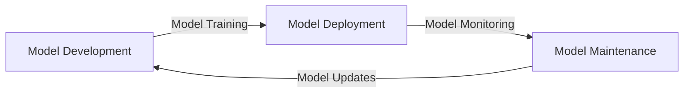

# AI Model Lineage
## Introduction
Automated AI model lineage tracking is crucial for transparency and reproducibility in AI model development.
## Problem Statement
Current AI model development processes lack transparency and reproducibility, making it difficult to track model changes and maintain model integrity.
## Why it Matters
AI model lineage tracking enables better model management and maintenance, reducing the risk of model drift and improving overall model performance.
## Architecture

## Project Structure
```
ai-model-lineage/
|---- README.md
|---- CONTRIBUTING.md
|---- LICENSE
|---- requirements.txt
|---- main.py
|---- src/
|       |---- core.py
|       |---- utils.py
|---- tests/
|       |---- test_core.py
|       |---- test_utils.py
```
## Installation
```
pip install -r requirements.txt
```
## Quick Start
```
python main.py --help
```
## Configuration
Configuration is done through a JSON file.
## Design Decisions
The project uses a modular architecture, with separate modules for model development, deployment, and maintenance.
## Roadmap
* Implement model training and deployment modules
* Develop model monitoring and maintenance modules
* Integrate with popular AI frameworks
## Contribution
Contributions are welcome. Please follow the guidelines in CONTRIBUTING.md.
## License
MIT License
